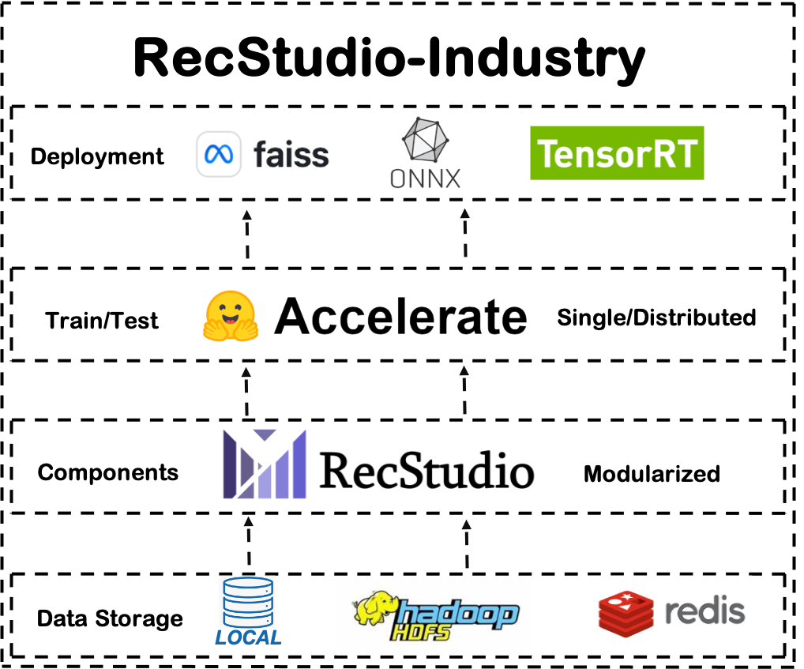

# RecStudio-Industry
RecStudio4Industry is the first [Pytorch](https://pytorch.org/)-based recommendation system development toolkit aimed at industrial internet applications. It inherits the modular design concept of [RecStudio](https://github.com/USTCLLM/RecStudio), aiming to help algorithm engineers quickly experiment with various modules by modularizing recommendation system models. Additionally, it adds industry-friendly features beyond RecStudio, supporting the rapid construction and deployment of industrial internet recommendation systems. 

The key industry features are as follows:

- It supports reading data from local and distributed file systems, such as HDFS. Unlike the small-batch datasets used in academia, industrial-level data is often very large and needs to be stored daily in the HDFS distributed file system. Therefore, RecStudio4Industry provides HDFS data reading interfaces to facilitate rapid integration with industrial scenario data. But it still supports reading data from local files for debugging.

- It supports various training configurations including single-machine single-card, single-machine multi-card, and distributed multi-machine multi-card training for the engineer's diverse devlopment needs. The huge amount of industrial data often demands higher training time, so RecStudio4Industry offers distributed training interfaces to facilitate rapid distributed training of industrial recommendation models. What's more, we utilize the [Accelerate](https://huggingface.co/docs/transformers/accelerate) to wrap the training process. It allows the engineer to switch between training and debugging by modifying a fews lines of code. 

- It supports easily deploying recommendation models into the industrial internet and severing the customer's request. RecStudio4Industry contains a high performance inference engine to satisfy the requirements online request's latency. The inference engine compresses the data using [Protocol Buffers](https://github.com/protocolbuffers/protobuf) firstly. It then stores the compressed data into the key-value database [Redis](https://redis.io/). And finally, [ONNX](https://onnx.ai/), [TensorRT](https://github.com/NVIDIA/TensorRT), and [Faiss](https://github.com/facebookresearch/faiss) are integrated into the inference engine to speed up the inference process. 

## Tutorial
The following tutorial will provide a detailed introduction on training and deploying recommendation models using RecStudio4Industry.

### Training
The following tutorial will introduce how to train a recommendation model using RecStudio4Industry. The training process includes the following steps:

1. Configuration of training data.
2. Model configuration and custom model building.
3. Lanuch training under local and distributed environments.
4. Saving and reading of models.

We provide an interactive notebook [tutorial](./doc/tutorials/training/quickstart.ipynb) for the training process. The notebook contains detailed descriptions of each stop and we encourage you to learn RecStudio4Industry by running the notebook steps by yourself.

### Deploying
In the section, we describes how to deploy the trained recommendation models using RecStudio4Industry. Limited by the latency of online request response, there exists some tecniques to speed up the inference process. Sepcifically, the deploying process includes the following steps:

1. Compressing the data using Protocol Buffers.
2. Storing the compressed data into Redis and crossponding configurations.
3. Configuration and lanuch of Inference Engine.

We also give an interactive notebook [tutorial](./doc/tutorials/inference/quickstart.ipynb) for the deploying process. The tutorial describes each step in detail and you can run it to be familiar with the deploying. 

### Data preparation
In our tutorial, we use the [RecFlow](https://github.com/RecFlow-ICLR/RecFlow) dataset as an example to train recommendation models and deploy them online. The RecFlow dataset includes samples from the exposure space and unexposed items filtered at each stage of Kuaishou's multi-stage RS. The whole RecFlow dataset is too large to be stored in the local file system, and we use HDFS as the storage medium. But we also provide a small sampled RecFlow dataset in the [learning folder](https://rec.ustc.edu.cn/share/180a6d10-b082-11ef-ad4a-d94633879361) of RecFlow for learning Recstudio4Industry. 